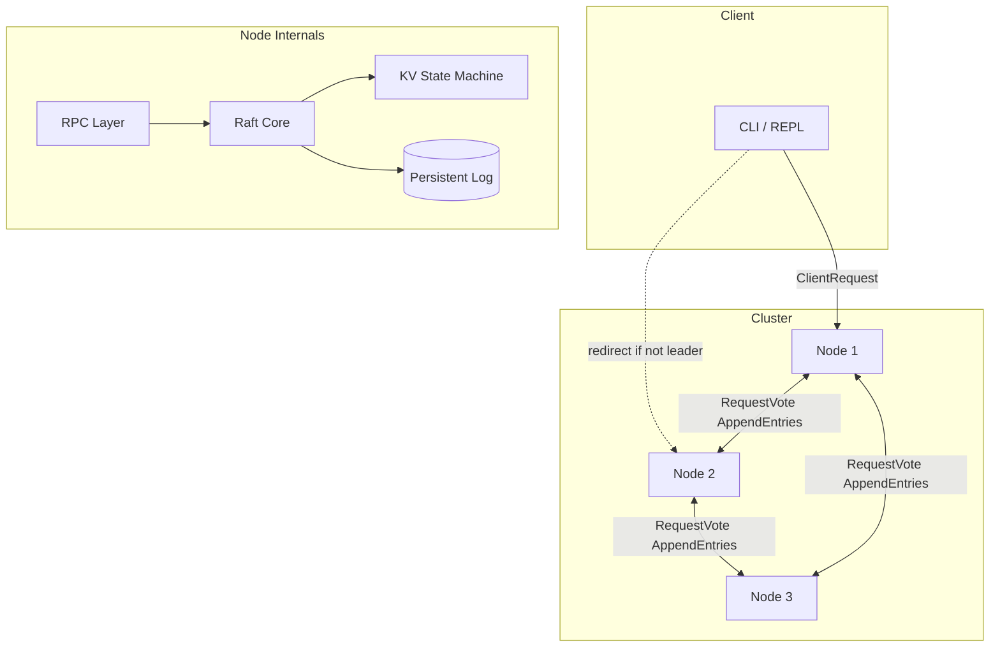

# Part 6: Polish & Write-Up

**Goal:** Turn a working implementation into a portfolio piece that gets interview questions.

**Time:** Ongoing (1–2 days for minimum polish)

---

## 6.1 CLI client improvements

Upgrade `cmd/client/main.go`:

### Features to add

1. **Auto-discover leader** — try all peer addresses until one accepts writes
2. **Interactive REPL mode**

```bash
go run ./cmd/client -cluster localhost:9001,localhost:9002,localhost:9003
> SET foo bar
OK
> GET foo
bar
> DELETE foo
OK (existed: true)
```

### REPL skeleton

```go
func repl(addrs []string) {
    scanner := bufio.NewScanner(os.Stdin)
    fmt.Println("raft-kv REPL (SET key val | GET key | DELETE key | quit)")
    for {
        fmt.Print("> ")
        if !scanner.Scan() { return }
        line := strings.TrimSpace(scanner.Text())
        if line == "quit" { return }
        // parse and route to leader
    }
}
```

---

## 6.2 Multi-node launcher script

Create `scripts/run-cluster.sh`:

```bash
#!/usr/bin/env bash
set -euo pipefail

ROOT="$(cd "$(dirname "$0")/.." && pwd)"
DATA="$ROOT/data"
mkdir -p "$DATA"

for id in 1 2 3; do
  port=$((9000 + id))
  go run "$ROOT/cmd/server" \
    -id "$id" \
    -peers "1,2,3" \
    -addr ":$port" \
    -data "$DATA/node-$id" &
  echo "started node $id on :$port pid $!"
done

trap 'kill $(jobs -p) 2>/dev/null' EXIT
wait
```

```bash
chmod +x scripts/run-cluster.sh
./scripts/run-cluster.sh
```

---

## 6.3 README structure (recruiters read this)

Your root `README.md` should replace the learning guide intro with a **project README**. Keep the guide in `docs/`.

### Required sections

```markdown
# raft-kv-store

Distributed fault-tolerant key-value store using the Raft consensus algorithm.
Built from scratch in Go — no etcd, no consul, no raft library.

## Demo

[Terminal recording or GIF: 3-node cluster, kill leader, write still works]

## Architecture

[Diagram — see below]

## Features

- Leader election with randomized timeouts
- Log replication with majority commit
- Crash recovery via persistent WAL
- Chaos-tested (partitions, leader kills, message duplication)

## Quick start

\`\`\`bash
./scripts/run-cluster.sh
go run ./cmd/client -cluster localhost:9001,localhost:9002,localhost:9003
\`\`\`

## Testing

\`\`\`bash
go test -race ./...
\`\`\`

## Bugs I hit and how I found them

[Link to BUGS.md — summarize top 3-5]

## What I'd do next

- Snapshotting / log compaction
- Linearizable reads (ReadIndex)
- gRPC + protobuf wire format
- Prometheus metrics
```

---

## 6.4 Architecture diagram

Include in README (Mermaid works on GitHub):



Draw this yourself first — copying without understanding won't help in interviews.

---

## 6.5 Metrics (stretch)

Expose HTTP `/metrics` on each node:

| Metric | Type | Meaning |
|--------|------|---------|
| `raft_state` | gauge | 0=follower, 1=candidate, 2=leader |
| `raft_term` | gauge | current term |
| `raft_commit_index` | gauge | last committed index |
| `raft_log_length` | gauge | log entries |
| `raft_leader_changes_total` | counter | elections won |

Use `prometheus/client_golang` or log periodically for simplicity.

Grafana dashboard is impressive but optional.

---

## 6.6 Interview prep — questions you'll get

Prepare answers from **your** implementation:

### "Walk me through a write."

Use the diagram from Part 3. Mention term, index, majority, commit, apply.

### "What happens when the leader dies mid-write?"

Client timeout → retry → new election → uncommitted entry lost on old leader → client retries → new entry in new term.

### "How do you prevent split brain?"

Majority overlap between terms → at most one leader per term → election restriction on log completeness.

### "What's the hardest bug you fixed?"

Pull from `BUGS.md`. Be specific: logs, test that reproduced it, invariant you added.

### "How is this different from Redis Cluster?"

Redis Cluster shards data; Raft replicates a **log** for **strong consistency** on each shard. Different tradeoffs.

### "What would you add for production?"

Snapshotting, TLS, client request deduplication (idempotent client IDs), ReadIndex, membership changes (joint consensus).

---

## 6.7 Code quality checklist

- [ ] `go test -race ./...` clean
- [ ] `staticcheck ./...` no warnings
- [ ] No global mutable state without mutex
- [ ] All RPC handlers document lock ordering
- [ ] Module path updated everywhere (no `YOUR_USERNAME` left)
- [ ] `.gitignore` includes `data/` directory

### `.gitignore`

```
/data/
*.tmp
raft_state.json
```

---

## 6.8 Optional extensions (living project)

Pick one when core is solid:

| Extension | Difficulty | Interview value |
|-----------|-----------|-----------------|
| Log compaction + snapshotting | Medium | High — "how does Raft avoid unbounded logs?" |
| Membership changes (AddServer) | Hard | Very high |
| Sharded KV (multi-Raft groups) | Hard | Shows scaling thinking |
| gRPC transport | Low | Less important than correctness |
| Docker Compose deployment | Low | Nice for demo |

---

## 6.9 Final checkpoint ✓

- [ ] 3-node cluster runs via script
- [ ] CLI can SET/GET/DELETE through leader failover
- [ ] README has architecture diagram + bugs section
- [ ] `BUGS.md` has ≥3 real entries
- [ ] You can explain Raft for 5 minutes without notes
- [ ] GitHub repo is public with clean commit history

---

## You did it

You built what most candidates only describe in system design interviews. When you put this on your resume, phrase it like:

> **Raft KV Store** — Implemented Raft consensus from scratch in Go (leader election, log replication, persistence). 3-node cluster survives leader failure and network partitions. Validated with chaos tests for state consistency.

Good luck — and keep `BUGS.md` updated. The bugs are the best part.
